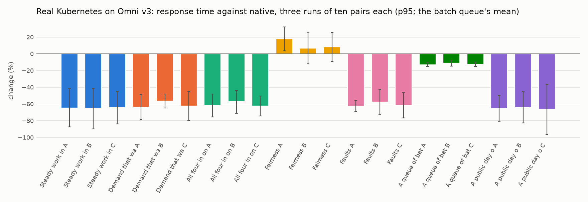

# The Omni-Compass Dossier

> © 2026 The Omni-Compass LLC. All rights reserved. **Evaluation and simulation use only.** Any commercial use, commercialization, monetization, production use, redistribution or hosted service of any part of Omni-Compass requires a signed, paid Omni-Compass Enterprise License from The Omni-Compass LLC. Patents, copyrights and trademarks filed in the USA. See `LICENSE`, `NOTICE` and `DISCLOSURES.md`.

> **PROPRIETARY - EVALUATION AND SIMULATION USE ONLY.** Copyright (c) 2026 The Omni-Compass LLC. This is not open-source software (`SPDX-License-Identifier: LicenseRef-OmniCompass-Evaluation-1.0`). Any commercial use, commercialization, monetization, production use, redistribution, hosted service or incorporation into a product requires a signed, paid **Omni-Compass Enterprise License** from The Omni-Compass LLC. Patent applications, copyright registrations and trademark applications covering the Omni-Compass engine, its mathematics and its software have been filed in the United States by The Omni-Compass LLC. See [`LICENSE`](../LICENSE).

Every mechanism, harness, receipt and result, read from the files named beside it. Built by `tools/dossier.py` at commit `22b12ae4`. Evidence classes: **T** theorem, **V** verified in code, **S** a model, **L** live software (real Kubernetes), **P** a physical meter. A model is not a meter, and a model written by the people who wrote the law is not an independent test; where a result is a model it says so.

## 1. The mechanism, and proof that it is the one that ran

| Check | Result | Where |
|---|---|---|
| The whole repository re-runs and checks itself (`python3 verify.py`) | **PASS** | `results/VERIFY_RECEIPT.txt` |
| The eight-line engine and its six states, fingerprinted (`omnicompass/core.py`) | sha256 `bd615f156169f679…` | `RELEASE_MANIFEST.json` |
| Python and C++20 twins of every law, proven equal and sealed | seal intact: 9 Python/C++ twins | `results/SEAL.json` |
| The mechanism's identity against the code | mechanism identity matches the code | `results/MECHANISM_IDENTITY.json` |
| The engine's convergence to its pole under the bounded command | proved | `docs/TRACKING_THEOREM.md` |
| Safety shield: 2,000,000 adversarial cases | 0 violations | `tests/test_shield_properties.py` |
| The compass law (push and pull, 5% cushions, fail up, plug contract) on every muscle, the card and Kubernetes | one law, one file | `omnicompass/compass_law.py` |
| Every file the results depend on, by fingerprint | written after the check passes | `RELEASE_MANIFEST.json` |

The engine is the founder's eight-line equation, integrated by RK4 with the bounded command held across all four stages; it is frozen and fingerprinted, and the C++ twin matches it. The compass law is the outer loop that moves each muscle's own setting: it reads one service position (0 calm, 1 the line), pulls it to the compass's center, pushes against whatever is rising, bounds its force by tanh, fails up past the wall, and writes through a plug that reads every lever once before the first write, reads back every write, yields to any other writer and restores the snapshot at the end.

## 2. Real Kubernetes, Omni v3, every test three times (evidence class L)

Seven tests, ten paired repetitions each, three separate GitHub runs on the frozen engine (A the result, B and C the replications): native Kubernetes (its HPA and scheduler) against the same Kubernetes with Omni-Compass on top, a fresh six-worker cluster per arm, order rotated, the same work sent to both arms. A row reads **confirmed better** or **confirmed worse** only when all three runs move the same way with every 95% interval clear of zero; otherwise it reads no difference beyond the noise, which is the result. Every Omni arm ends with every setting handed back and read back. Steady runs: A 38013195851 (omni-v3); B 38013200499 (omni-v3); C 38013204648 (omni-v3); the other tests' runs are named in their tables.

| Test | Work | Response time (p95; the batch queue's mean) | Machines in service | Energy (declared model) | Failed requests | Table |
|---|---|---|---|---|---|---|
| Steady work in steps | equal by design | **-66% to -64%, confirmed better** | **-2% to -2%, confirmed better** | **-2% to -1%, confirmed better** | same | `results/live/V3_STEADY.md` |
| Demand that wanders | not taken | **-64% to -56%, confirmed better** | no difference beyond the noise | no difference beyond the noise | **-13% to -12%, confirmed better** | `results/live/V3_WANDERING.md` |
| All four in one run | **+54% to +68%, confirmed better** | **-62% to -57%, confirmed better** | no difference beyond the noise | no difference beyond the noise | **-14% to -11%, confirmed better** | `results/live/V3_ALL_FOUR.md` |
| Fairness, a noisy neighbour | not taken | no difference beyond the noise | same | no difference beyond the noise | no difference beyond the noise | `results/live/V3_FAIRNESS.md` |
| Faults: machine down, spike, runaway pod, blind probe | not taken | **-63% to -58%, confirmed better** | no difference beyond the noise | no difference beyond the noise | **-18% to -14%, confirmed better** | `results/live/V3_FAULTS.md` |
| A queue of batch jobs | not taken | **-13% to -11%, confirmed better** | **-20% to -16%, confirmed better** | **-14% to -11%, confirmed better** | no difference beyond the noise | `results/live/V3_BATCH.md` |
| A public day of demand: the Google cluster trace of 2011, replayed one step at a time | not taken | **-66% to -64%, confirmed better** | **-9% to -7%, confirmed better** | **-7% to -5%, confirmed better** | **-18% to -11%, confirmed better** | `results/live/V3_TRACE_GOOGLE2011.md` |

Energy on kind is a declared model: the machines are containers on one runner, so a machine out of service saves modelled watts, not a metered bill. Omni-Compass gives a machine back only after a paired trial shows the service no slower without it (the verdict, `omnicompass/verdict.py`); on these clusters one machine fewer made requests 30-45% slower in most trials, so the machines stayed and were spent on speed and work. The v1 tables (`results/live/V1_*.md`, `docs/OMNI_V1.md`) read the same; the sets before v1 are in `docs/history/`.

## 3. A real database: PostgreSQL behind PgBouncer, Omni v3, three runs (evidence class L)

PostgreSQL 16 as shipped behind PgBouncer's shipped pool of 20 is native; omni is the compass law on one knob, the pool size, through PgBouncer's own console, inside the cover [2, 90] (`docs/POSTGRES_PREREGISTRATION.md`). Three paired repetitions a run, three runs, pgbench's own log for the gauges. Runs: A 38013313943; B 38013319893; C 38013324861.

| Workload | Work inside the 50 ms line | p95 | Connections held open | Host CPU-seconds (the compass's own cost) |
|---|---|---|---|---|
| `select` | no difference beyond the noise | no difference beyond the noise | **-11% to -6%, confirmed better** | no difference beyond the noise |
| `simple_update` | no difference beyond the noise | no difference beyond the noise | no difference beyond the noise | no difference beyond the noise |
| `tpcb_hot` | no difference beyond the noise | no difference beyond the noise | no difference beyond the noise | no difference beyond the noise |

The compass takes connections back only while the pooler's clients wait for one under 1% of the time and gives them back the moment anyone waits (amendment 2 of `docs/POSTGRES_PREREGISTRATION.md`, 8 October: the first counted set's CPU cost was measured and traced to the harness's own psql launches, not to the pooler, and its first table is kept whole in `docs/history/V3_PGBENCH_set1.md`). Where it reads a saving it is connections held open for the same work with the host's CPU inside the noise; where the add rule buys connections above the operator's setting on a slow write workload, that reads worse and is counted against Omni in the index. Table: `results/live/V3_PGBENCH.md`.

## 3b. Real messaging: Apache Kafka, a consumer group's operator-set size, Omni v3, three runs (evidence class L)

Apache Kafka as shipped (one broker, a topic of 8 partitions) with the consumer group at the operator's 2 consumers is native; omni is the compass law on one knob, the consumer count, inside the cover [1, 8], holding the group's own end-to-end latency at 40% of the 500 ms line (`docs/KAFKA_PREREGISTRATION.md`). Three paired repetitions a run, three runs, the consumers' own records for the gauges; the tuning workload is shown and not counted. Runs: A 38021564790; B 38013304929; C 38013309420.

| Workload | Work inside the 500 ms line | End-to-end p95 | Consumers running (the resource held) | Host CPU-seconds (the compass's own cost) |
|---|---|---|---|---|
| `tuning` (tuning, shown, not counted) | no difference beyond the noise | no difference beyond the noise | **-0% to -0%, confirmed better** | no difference beyond the noise |
| `burst` | no difference beyond the noise | no difference beyond the noise | **-1% to -1%, confirmed better** | no difference beyond the noise |
| `heavy` | no difference beyond the noise | no difference beyond the noise | **-0% to -0%, confirmed better** | no difference beyond the noise |
| `light` | no difference beyond the noise | no difference beyond the noise | no difference beyond the noise | no difference beyond the noise |

Native sat at nine tenths of its measured capacity by design, so its queue grew at the high steps and its slowest 5% waited about 1.6 s; Omni added consumers while messages waited and gave them back when the queue was empty, so its slowest 5% waited 9 to 14 ms, at the cost of three to four times the consumers running, confirmed worse and counted against Omni in the index. No message was lost in any arm; every count was handed back. Table: `results/live/V3_KAFKA.md`.

## 3c. A real cache: Redis, the operator's memory ceiling, Omni v3, three runs (evidence class L)

Redis as Ubuntu ships it with the operator's 64 MB ceiling and allkeys-lru is native; omni is the compass law on one knob, the ceiling, inside the cover [16, 512] MB through Redis's own console, growing only while the cache is full and giving a notch back when calm and nothing is evicted (`docs/REDIS_PREREGISTRATION.md`). An application with a declared 5 ms store trip on a miss and a working set that steps up and down; three paired repetitions a run, three runs; the tuning workload is shown and not counted. Runs: A 38013287665; B 38013291972; C 38013296599.

| Workload | Work inside the 2 ms line | Cache hit rate | p95 | Memory ceiling held, MB (the resource held) | Host CPU-seconds |
|---|---|---|---|---|---|
| `tuning` (tuning, shown, not counted) | the runs disagree | the runs disagree | no difference beyond the noise | no difference beyond the noise | no difference beyond the noise |
| `burst` | no difference beyond the noise | no difference beyond the noise | no difference beyond the noise | no difference beyond the noise | no difference beyond the noise |
| `large` | no difference beyond the noise | no difference beyond the noise | no difference beyond the noise | no difference beyond the noise | no difference beyond the noise |
| `small` | no difference beyond the noise | no difference beyond the noise | no difference beyond the noise | no difference beyond the noise | no difference beyond the noise |

The memory the compass holds for a wide working set is the resource this benchmark trades, and reads worse by rule. Table: `results/live/V3_REDIS.md`.

## 3d. A real database's storage-engine cache: MongoDB under YCSB, the operator's cache size, Omni v3, three runs (evidence class L)

MongoDB 8.0 as its publisher ships it with the operator's WiredTiger cache of 512 MB is native; omni is the compass law on one knob, the cache size, inside the cover [256, 2,048] MB through the server's own console, growing by notches of 64 MB only while the cache is full and reads are slow, and giving a notch back when calm and the cache holds its working set (`docs/YCSB_PREREGISTRATION.md`; the first counted set's gate was 'nothing evicted', which its amendment 1 of 8 October records as satisfied by a cold cache, and the table named below says which set it is). YCSB's published core workloads with the key space stepping through the cache and past it, drawn uniformly, at 3,000 operations a second from 32 threads; three paired repetitions a run, three runs; the tuning workload (workload A) is shown and not counted. Runs: A 38013343689; B 38013348512; C 38013353044.

| Workload | Work inside the 1 ms line | p95 | Cache size held, MB (the resource held) | Pages read into the cache | Host CPU-seconds |
|---|---|---|---|---|---|
| `tuning` (tuning, shown, not counted) | no difference beyond the noise | no difference beyond the noise | no difference beyond the noise | shown, not judged | no difference beyond the noise |
| `b` | no difference beyond the noise | no difference beyond the noise | no difference beyond the noise | shown, not judged | no difference beyond the noise |
| `burst` | no difference beyond the noise | no difference beyond the noise | no difference beyond the noise | shown, not judged | no difference beyond the noise |
| `c` | no difference beyond the noise | no difference beyond the noise | no difference beyond the noise | shown, not judged | no difference beyond the noise |
| `f` | no difference beyond the noise | no difference beyond the noise | **-13% to -3%, confirmed better** | shown, not judged | no difference beyond the noise |

On this machine the data files sit in the operating system's page cache as well, so a storage-engine miss is a read from memory, not a disk, as disclosed before the run: the result is memory given back at no measurable cost in work inside the line, p95 or CPU, with one confirmed loss, the mean latency on the burst workload. Table: `results/live/V3_YCSB.md`.

## 3e. A real database's buffer pool: MySQL under sysbench, the operator's InnoDB pool size, Omni v3, three runs (evidence class L)

MySQL 8.0 as Ubuntu ships it with the operator's 512 MB InnoDB buffer pool is native; omni is the compass law on one knob, the pool size, inside the cover [128, 2,048] MB in the server's own 128 MB chunks through its own console, growing only while the pool is full and the server's own statement latency is slow, and giving a chunk back only while the pool's misses are under 1% of its reads (`docs/MYSQL_PREREGISTRATION.md`). sysbench's OLTP scripts as shipped with the tables in use stepping through the pool and past it, at a fixed offered rate from 32 threads; three paired repetitions a run, three runs; the tuning workload (point select) is shown and not counted. Runs: A 38013329351; B 38013334121; C 38013338730.

| Workload | Work inside the line | p95 | Buffer pool held, MB (the resource held) | Pages read from disk | Host CPU-seconds |
|---|---|---|---|---|---|
| `tuning` (tuning, shown, not counted) | no difference beyond the noise | no difference beyond the noise | no difference beyond the noise | shown, not judged | no difference beyond the noise |
| `burst` | no difference beyond the noise | no difference beyond the noise | no difference beyond the noise | shown, not judged | no difference beyond the noise |
| `read_only` | no difference beyond the noise | no difference beyond the noise | no difference beyond the noise | shown, not judged | no difference beyond the noise |
| `read_write` | no difference beyond the noise | no difference beyond the noise | **-20% to -10%, confirmed better** | shown, not judged | no difference beyond the noise |
| `update_index` | no difference beyond the noise | no difference beyond the noise | no difference beyond the noise | shown, not judged | no difference beyond the noise |

The third counted set, on amendment 2 (the pool grows only while it is missing): the pool held −49% to −56% on burst, confirmed better, with work, latency and CPU inside the noise; on read_write the pages held read +44% to +52%, confirmed worse, with the host's CPU −4% to −6%, confirmed better, a trade counted both ways in the index; read_only inside the noise and update_index disagreeing; the pool handed back on all 45 omni arms. The second counted set (the pool −67% on burst and −50% to −56% on read_only, read_write's pages held +53% to +70% worse) is kept whole in `docs/history/V3_SYSBENCH_set2.md`; the first counted set (every row inside the noise; 15 of 45 arms not handed back because the plug's restore was issued while the server was still withdrawing the blocks of a shrink, which MySQL ignores; the plug fixed and the fix declared) is kept whole in `docs/history/V3_SYSBENCH_set1.md`. The update_index work-inside-the-line row counts almost nothing in either arm (a single update's client round trip exceeds the server-side 0.6 ms line) and is disclosed. Table: `results/live/V3_SYSBENCH.md`.

## 4. The bill on a real cloud: Azure Kubernetes Service, Omni v1 (evidence class L, a metered bill)

Azure's own cluster autoscaler is native; omni is the same autoscaler with Omni-Compass idling the machines it gives back; the bill is Azure's own count of machines every 15 s at list price, a fresh cluster per arm, deleted after it (`.github/workflows/aks-metered.yml`, `docs/K8S_COMPASS_PREREGISTRATION.md`, the bill on a real cloud). Transcribed from the receipts they cite:

| Test | Fleet | Bill | Response time | Reading | Receipt |
|---|---|---|---|---|---|
| Steady load, 5 pairs | 4 workers | −4.7%, interval across zero | inside the noise | no difference beyond the noise on any gauge | `results/live/V1_AKS_STEADY.md` |
| A burst sized to the cluster, 5 pairs | 4 workers | +5.0%, interval across zero | p99 −34% clear of the noise in this one run; p95 inside the noise | the bill inside the noise | `results/live/V1_AKS_BURST.md` |

One machine is a quarter of a 4-worker fleet, so only a saving of about 30% or more can clear the noise there; the expected machine saving is a few percent. The fleet that can show one machine (40 workers in nine machine families, the subscription's per-family allowance being 10 vCPUs) is preregistered and dispatched on v3; its first dispatches were refused by the subscription's allowances and by Azure's own cluster capacity in eastus before any arm ran, each refusal recorded in the preregistration's amendments.

## 4b. The GPU governor on the modelled card: each base alone, and with Omni on top (evidence class S)

Omni-Compass never runs the card. It sits on the card's own firmware (or on an operator's power cap) and moves the clock ceiling and the power limit, which that base already accepts (`omni_controller/gpu_compass.py`, the same law in `realms/gpu_card.py`). A step down is taken only after a paired trial on the card shows it adds at most 2% to the card's own time on a request (`omnicompass/verdict.py`); where no step passes, the card runs as it does alone.

| Work | Base | Energy (tuning / fresh) | Median response | p95 | p99 |
|---|---|---:|---:|---:|---:|
| Compute-bound | firmware + Omni vs firmware alone | -0.70% / -0.48% | +1.56% / +1.47% | -0.84% / +0.01% | -0.09% / +0.02% |
| Compute-bound | 105 W cap + Omni vs the cap alone | +0.02% / -0.11% | -12.29% / -25.59% | -6.41% / -7.06% | -3.15% / -5.82% |
| AI token generation | firmware + Omni vs firmware alone | -3.25% / -3.72% | +0.55% / +0.70% | +0.29% / +0.26% | +0.02% / -0.52% |
| AI token generation | 105 W cap + Omni vs the cap alone | -2.10% / -2.38% | +0.07% / +0.12% | +0.03% / -0.02% | -0.06% / -1.57% |

Source: `results/sim/gpu_two_wire/RESULT.md` and `fresh/RESULT.md`. The rule, and why the allowance is 2%, is amendment 8 of `docs/GPU_PREREGISTRATION.md`.

## 5. The six organisms at 1, 10, 100 and 1,000 runs and sizes, Omni v3 (evidence class S)

Each organism runs native (its own controllers) and with the compass law on every muscle, same seed, same load, same clock. Size is the number of copies of the organism governed together on one clock (1,000 copies of the four stacked is 1.7 million modelled muscles); runs are the first N of the same paired set, so 1, 10, 100 and 1,000 nest. 84 of 90 cells are done; the six left (100 and 1,000 runs at 1,000 copies) are beyond the machines available and say so.

The full grid with every cell: `results/scale/GRID.md`; the receipts, one per size: `results/scale/receipts/`. Work per energy is better in every cell, the same figure at every size (+0.07% for Physics to +0.37% for Energy, the four stacked and the tower); the time over the service line is at or under native's in every cell, so the band-first rule holds and every cell of 10 runs or more is labelled superior within guardrails by the preregistered rule. Every knob was handed back in every run.

## 6. The 945 muscles and the four realms, Omni v3 (evidence class S)

The catalog (`realms/catalog.csv`): 945 muscles in 59 families, 430 in Compute / AI / Cloud, 376 in Physics / Robotics / Autonomous, 470 in Energy / Facility / Industrial and 440 in Distribution / Specialized (1,716 counting a muscle once per realm, a shared spine of 257). Every muscle alone and every organism whole ran as A, B and C on v3 and reproduced to the last digit (`results/realms/REALMS.md`): 0 muscles worse, every organism superior within guardrails (work per energy +0.1% to +0.3%, work unchanged, time over the line not above native's). On v2 the Physics realm and the tower read a service tradeoff; the cause was a missing do-no-harm gate on speed knobs, which made v3 (`docs/OMNI_V3.md`). Three independent simulators with their own native controllers are wired the same way and read by the same rule: the power grid (`results/live/V3_PANDAPOWER.md`: energy drawn and net import better in all 11 SimBench grids with ZIP loads, losses worse in 4, tap operations 4 → 8 a year in one), robot arms (`results/live/V3_MUJOCO.md`: Gen3 peak torque −29%, tracking error −21%, energy per takt −0.8%; the Panda's copper +14% worse; two arms left native) and CityLearn (`results/live/V3_CITYLEARN.md`: electricity bought, peak and unevenness better in all 11 battery districts; the bill worse in 7). Losses stand in every table.

## 7. Harnesses and receipts

| Harness | What it proves | Receipt |
|---|---|---|
| `scripts/kind_paired.sh`, `tools/live_reps.py`, workflow `benchmark-reps` | native against Omni on real Kubernetes, paired on one runner, the reset checked | `results/live/raw/run-*/live-reps/` |
| `tools/confirm_abc.py` (and `pgbench_abc.py`, `kafka_abc.py`, `redis_abc.py`, `swarm_abc.py`, `mujoco_abc.py`, `pandapower_abc.py`, `citylearn_abc.py`) | three separate runs read by one rule: confirmed better, confirmed worse, no difference beyond the noise, the runs disagree; each run's engine checked against the fingerprint | `results/live/V3_*.md`, `V1_*.md` |
| `tools/omni_version.py` | which frozen engine a checkout or any result's commit carries | `OMNI_V1.json`, `OMNI_V2.json`, `OMNI_V3.json` |
| `scripts/aks_paired.sh`, workflow `aks-metered` | the same on Azure's managed Kubernetes, Azure's own bill, a fresh cluster per arm, the fleet pre-flighted against the subscription's allowances | `results/live/V1_AKS_*.md` |
| `tools/run_kil.py`, workflows `six-kube`, `big-organism`, `big-organism-detached`; `tools/six_kube_report.py` | the six organisms with a real cluster inside at 1 to 1,000 copies, on GitHub and on a rented machine; the clock rule | `results/live/V1_SIX_KUBE.md`, `V3_SIX_KUBE.md`, `V1_BIG_ORGANISM.md` |
| `tools/run_pgbench.py`, workflow `pgbench` | a real database behind its pooler, one knob through the pooler's console | `results/live/V3_PGBENCH.md` |
| `tools/run_kafka.py`, workflow `kafka` | a real message broker as shipped, one knob (the consumer group's size) read from the consumers' own records | `results/live/V3_KAFKA.md` |
| `tools/run_redis.py`, workflow `redis` | a real cache as shipped, one knob (the memory ceiling) through its own console, growing only while the cache is full | the three-run table V3_REDIS.md in `results/live/` when its runs land |
| `tools/run_swarm.py`, workflow `swarm` | Omni on top of each drone's shipped autopilot in gym-pybullet-drones, collisions voiding the cell | `results/live/V3_SWARM.md` |
| `tools/run_scale.py`, `tools/pool_scale.py`, workflow `six`; `tools/grid.py` | the six organisms at every run count and size | `results/scale/GRID.md`, `results/scale/receipts/` |
| `tools/run_realms.py`, workflow `realms` | every muscle alone and every organism whole | `results/realms/REALMS.md` |
| `tools/run_pandapower.py`, `run_mujoco.py`, `run_citylearn.py` | Omni on top of an independent simulator's own controller | `results/live/V3_PANDAPOWER.md`, `V3_MUJOCO.md`, `V3_CITYLEARN.md` |
| `tools/omni_index.py` | the one combined number, read only from the three-run tables | `results/OMNI_INDEX.md` |
| `scripts/gpu_rented_run.sh`, `tools/gpu_wire_check.py` | one command on a rented card: wire check, smoke, the organisms with the card inside, the preregistered confirmation | the founder's runs, to come |
| workflow `archive-run` | every finished run's files copied with the code, one SHA-256 manifest per repetition | `results/live/raw/run-<id>/` |
| `verify.py`, `tools/release_manifest.py` | everything above re-runs and checks itself; the manifest fingerprints the result | `results/VERIFY_RECEIPT.txt`, `RELEASE_MANIFEST.json` |

The rules for each run were written and committed before it ran (`docs/*_PREREGISTRATION.md`); every row is reported, losses included; nothing is read across engine versions.

## 8. What is not yet shown

- A cloud-bill or energy saving on real machines: the 4-worker Azure fleet reads inside the noise, as a fleet too small to show one machine must; the 40-worker fleet runs are the test of that.
- The real card on the current governor: every earlier card result ran on a controller since replaced and is obsolete; the one-card, card-inside-the-organisms and eight-card runs are the founder's, on rented cards, at one named commit.
- The four stacked and the tower at 1,000 copies with the real cluster inside on v3 (the stack runs on a rented machine).
- 100 and 1,000 runs at 1,000 copies (beyond the machines available).
- The queue in `docs/REGISTER.md` section 4 (drone swarms on gym-pybullet-drones and Kafka done; Redis running): PX4 and ArduPilot swarms, YCSB and HammerDB, Spark, OpenSearch, fio, Open-RMF, the 24-hour robustness run, Basilisk, Orekit and GMAT, RocketPy, Cantera.

---

*© 2026 The Omni-Compass LLC. All rights reserved. **Evaluation and simulation use only.** Any commercial use, commercialization, monetization, production use, redistribution or hosted service of any part of Omni-Compass requires a signed, paid Omni-Compass Enterprise License from The Omni-Compass LLC. Patents, copyrights and trademarks filed in the USA. See `LICENSE`, `NOTICE` and `DISCLOSURES.md`.*
