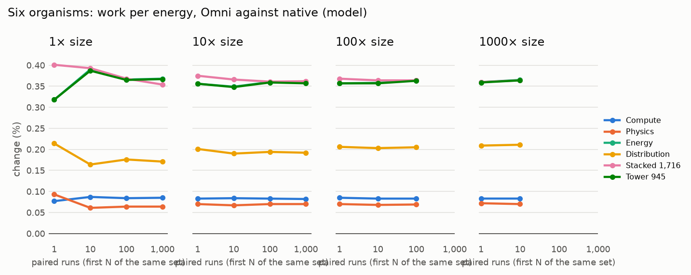
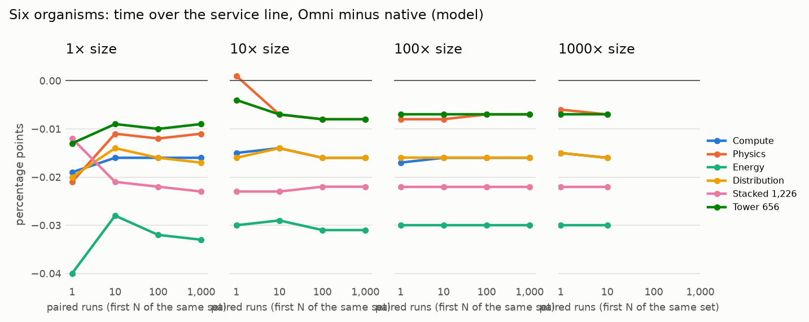

# The Omni-Compass Dossier

> **PROPRIETARY - EVALUATION AND SIMULATION USE ONLY.** Copyright (c) 2026 The Omni-Compass LLC. This is not open-source software (`SPDX-License-Identifier: LicenseRef-OmniCompass-Evaluation-1.0`). Any commercial use, commercialization, monetization, production use, redistribution, hosted service or incorporation into a product requires a signed, paid **Omni-Compass Enterprise License** from The Omni-Compass LLC. Patent applications, copyright registrations and trademark applications covering the Omni-Compass engine, its mathematics and its software have been filed in the United States by The Omni-Compass LLC. See [`LICENSE`](../LICENSE).

Every mechanism, harness, receipt and result, read from the files named beside it. Built by `tools/dossier.py` at commit `9ec6e50`. Evidence classes: **T** theorem, **V** verified in code, **S** a model, **L** live software (real Kubernetes), **P** a physical meter. A model is not a meter, and a model written by the people who wrote the law is not an independent test; where a result is a model it says so.

## 1. The mechanism, and proof that it is the one that ran

| Check | Result | Where |
|---|---|---|
| The whole repository re-runs and checks itself (`python3 verify.py`) | **PASS** | `results/VERIFY_RECEIPT.txt` |
| The eight-line engine and its six states, fingerprinted (`omnicompass/core.py`) | sha256 `bd615f156169f679…` | `RELEASE_MANIFEST.json` |
| Python and C++20 twins of every law, proven equal and sealed | seal intact: 9 Python/C++ twins | `results/SEAL.json` |
| The mechanism's identity against the code | mechanism identity matches the code | `results/MECHANISM_IDENTITY.json` |
| The engine's convergence to its pole under the bounded command | proved | `docs/TRACKING_THEOREM.md` |
| Safety shield: 2,000,000 adversarial cases | 0 violations | `tests/test_shield_properties.py` |
| The bowl law (push and pull, 5% cushions, fail up, plug contract) on every muscle, the card and Kubernetes | one law, one file | `omnicompass/bowl.py` |
| Every file the results depend on, by fingerprint | written after the check passes | `RELEASE_MANIFEST.json` |

The engine is the founder's eight-line equation, integrated by RK4 with the bounded command held across all four stages; it is frozen and fingerprinted, and the C++ twin matches it. The bowl law is the outer loop that moves each muscle's own setting: it reads one service position (0 calm, 1 the line), pulls it to the bowl's center, pushes against whatever is rising, bounds its force by tanh, fails up past the wall, and writes through a plug that reads every lever once before the first write, reads back every write, yields to any other writer and restores the snapshot at the end.

## 2. The real GPU (evidence class P)

NVIDIA A10 on Lambda, 2026-10-02, frozen at commit `c908054`, 10 paired repetitions of native, Omni watching only and Omni governing, 600 s each, energy from the card's own power meter. Wire check 7 of 7; every write read back; every arm ended at the start limit.

| Gauge | Native | Omni | Change | 95% interval | Verdict |
|---|---:|---:|---:|---:|---|
| Work per energy | 50.79 | 52.62 | +3.6% | +2.7% to +4.5% | better, proven |
| GPU energy | 6.918e+04 | 6.679e+04 | -3.5% | -4.4% to -2.6% | better, proven |
| GPU power | 109.5 | 105.7 | -3.5% | -4.4% to -2.6% | better, proven |
| Response, mean | 159.6 | 236.5 | +48.2% | +40.9% to +55.6% | worse, proven |
| Response, p95 | 510.1 | 808.7 | +58.5% | +47.4% to +69.6% | worse, proven |
| Response, p99 | 766.6 | 1232 | +60.8% | +40.5% to +81.0% | worse, proven |

**Result, by rule: ENERGY IMPROVEMENT WITH SERVICE TRADEOFF.** The energy result is proven; the 95th-percentile response time breached the +10% guardrail. The cause, read from the card's own samples, was wiring in the governor (bursts served at 736-768 MHz against 861-889 MHz on the card's own); corrected in amendments 6 and 7 of `docs/GPU_PREREGISTRATION.md`. The corrected governor is the next card run.

### The real card inside the six organisms

The card is one more muscle of each organism, governed by the same bowl law as the 656 modelled muscles; its energy and requests are its own meter (`results/hil/run-20261002T082232Z/HIL.md`).

| Organism | The card, work per energy (meter) | The modelled stacks, work per energy |
|---|---:|---:|
| Compute / AI / Cloud (345) | +2.00% | +0.32% |
| Physics / Robotics / Autonomous (262) | +2.68% | +0.24% |
| Energy / Facility / Industrial (282) | +2.75% | +0.21% |
| Distribution / Specialized (337) | +2.37% | +0.25% |
| The four stacked (1,226) | +1.63% | +0.21% |
| The whole tower (656) | +2.62% | +0.23% |

In every organism the card served the same requests with none lost; its p95 rose from about 500 ms to 600-935 ms under the governor of that run (the same wiring fault).

## 3. The GPU governor on the modelled card: each base alone, and with Omni on top (evidence class S)

Omni-Compass never runs the card. It sits on the card's own firmware (or on an operator's power cap) and moves the clock ceiling and the power limit, which that base already accepts (`omni_controller/gpu_bowl.py`, the same law in `realms/gpu_card.py`). A step down is taken only after a paired trial on the card shows it adds at most 2% to the card's own time on a request (`omnicompass/verdict.py`); where no step passes, the card runs as it does alone.

| Work | Base | Energy (tuning / fresh) | Median response | p95 | p99 |
|---|---|---:|---:|---:|---:|
| Compute-bound | firmware + Omni vs firmware alone | -0.70% / -0.48% | +1.56% / +1.47% | -0.84% / +0.01% | -0.09% / +0.02% |
| Compute-bound | 105 W cap + Omni vs the cap alone | -0.10% / -0.24% | -1.27% / -1.30% | -0.01% / -0.17% | -0.00% / -0.13% |
| AI token generation | firmware + Omni vs firmware alone | -3.25% / -3.72% | +0.55% / +0.70% | +0.29% / +0.26% | +0.02% / -0.52% |
| AI token generation | 105 W cap + Omni vs the cap alone | -2.09% / -2.37% | +0.07% / +0.12% | +0.00% / +0.03% | +0.00% / +0.06% |

Source: `results/sim/gpu_two_wire/RESULT.md` and `fresh/RESULT.md`. The rule, and why the allowance is 2%, is amendment 8 of `docs/GPU_PREREGISTRATION.md`.

## 4. Real Kubernetes (evidence class L)

Each set: 10 paired repetitions on one runner, native Kubernetes (HPA, scheduler) against the same Kubernetes with Omni-Compass on top, fresh cluster per arm, order rotated, fixed-rate load so both arms do the same work. Every Omni arm ends with the reset, which must return every setting and every machine to native.

| Set | Law | Machines in service | p95 response | Failed requests | Total CPU incl. Omni's own | Receipt |
|---|---|---:|---:|---:|---:|---|
| 22 | allocation | −31.0% | −61.0% | 0 / 0 | -0.9% (not significant) | `results/live/LIVE_REPS_22.md` |
| 23 | allocation | −28.7% | −62.2% | 0 / 0 | -1.0% (not significant) | `results/live/LIVE_REPS_23.md` |
| 24 | allocation | −31.6% | −60.1% | 0 / 0 | -1.8% (not significant) | `results/live/LIVE_REPS_24.md` |
| 25 | allocation | −32.3% | −57.3% | 0 / 0 | -0.6% (not significant) | `results/live/LIVE_REPS_25.md` |
| 26 | allocation | −35.8% | −55.4% | 0 / 0 | -1.5% (not significant) | `results/live/LIVE_REPS_26.md` |
| 26 | bowl | −17.2% | −64.8% | 0 / 0 | +1.0% (not significant) | `results/live/LIVE_REPS_26.md` |
| 27 | allocation | −36.6% | −53.1% | 0 / 0 | -0.0% (not significant) | `results/live/LIVE_REPS_27.md` |
| 27 | bowl | −15.9% | −65.5% | 0 / 0 | +0.2% (not significant) | `results/live/LIVE_REPS_27.md` |

Machines and response time are proven better in every set. Total CPU including the controller's own cost is no different from native: the service uses 6-9% less CPU (proven) and the controller spends about 0.07 cores, on the same 4-core runner. Set 27 runs the bowl aligned with the GPU governor (`docs/K8S_BOWL_PREREGISTRATION.md`, set 27): machines −15.9%, p95 −65.5%, labelled *better on machines within the band* by its preregistered rule.

## 5. The six organisms at 1, 10, 100 and 1,000 runs and sizes (evidence class S)

Each organism runs native (its own controllers) and with the bowl law on every muscle, same seed, same load, same clock. Size is the number of copies of the organism governed together on one clock; runs are the first N of the same paired set, so 1, 10, 100 and 1,000 nest. 100× and 1,000× are being computed on GitHub; their cells read 'running' until they land. 1,000 runs at 1,000× is beyond the free machines.

The full grid with every cell: `results/scale/GRID.md`. Work per energy is better in every completed cell; the time over the service line is about 0.2 points higher in every completed cell, so the band-first rule is not yet held on the modelled organisms. That is the open work on the realm muscles; the card and Kubernetes were brought into the band first.

## 6. The 656 muscles and the four realms (evidence class S)

The catalog (`realms/catalog.csv`): 656 muscles, 345 in Compute / AI / Cloud, 262 in Physics / Robotics / Autonomous, 282 in Energy / Facility / Industrial and 337 in Distribution / Specialized (1,226 counting a muscle once per realm). Every muscle alone and every organism are in `results/realms/REALMS.md` (round 3, the earlier governor) and in the six-organism grid above (the bowl law). Every knob was handed back in every run.

## 7. Harnesses and receipts

| Harness | What it proves | Receipt |
|---|---|---|
| `scripts/gpu_rented_run.sh` | one command on a rented card: wire check, smoke, the six organisms with the card inside, the preregistered confirmation; one packed file back | `results/gpu/run-*`, `results/hil/run-*` |
| `tools/gpu_wire_check.py` | both of the card's wires follow, read back and go home; another writer is left alone | `results/gpu/wirecheck-*.txt` |
| `scripts/kind_paired.sh`, `tools/live_reps.py` | native against Omni on real Kubernetes, paired on one runner, with the reset checked | `results/live/LIVE_REPS_*.md` |
| `tools/run_scale.py`, `.github/workflows/six.yml` | the six organisms at every run count and size | `results/scale/GRID.md` |
| `tools/run_gpu_card.py` | the modelled card, both profiles, tuning and fresh seeds | `results/sim/gpu_two_wire/` |
| `verify.py` | everything above re-runs and checks itself; the manifest fingerprints the result | `results/VERIFY_RECEIPT.txt`, `RELEASE_MANIFEST.json` |

Every raw result folder carries its `SHA256SUMS.txt`; the rules for each run were written and committed before it ran (`docs/GPU_PREREGISTRATION.md`, `docs/REALMS_PREREGISTRATION.md`, `docs/K8S_BOWL_PREREGISTRATION.md`).

## 8. What is not yet shown

- The corrected GPU governor on a real card (the run after amendments 6 and 7).
- Band first on the modelled organisms (time over the line about +0.2 points).
- Energy saved on real hardware for Kubernetes: kind keeps every machine powered, so energy there is a declared model.
- A net CPU saving on Kubernetes once the controller's own cost is counted on a small runner.
- 1,000 runs at 1,000× (needs a larger machine).

---

*Evaluation and simulation use only. Copyright (c) 2026 The Omni-Compass LLC. Commercial use, commercialization or
monetization of any part of Omni-Compass requires a signed, paid Omni-Compass Enterprise License from The Omni-Compass LLC.
Patent applications, copyright registrations and trademark applications filed in the United States. See `LICENSE` and
`NOTICE` at the root of this repository.*
